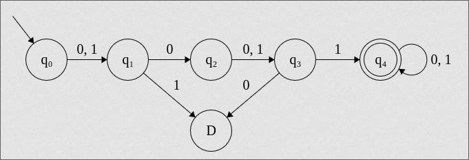
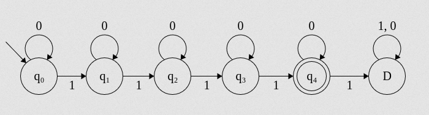
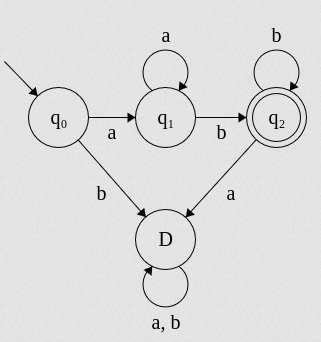
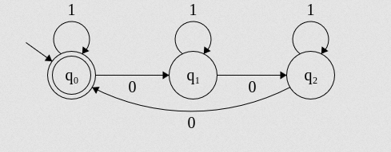
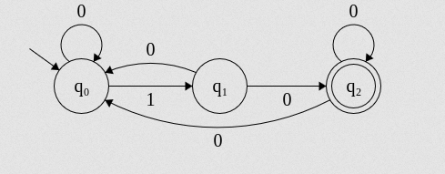
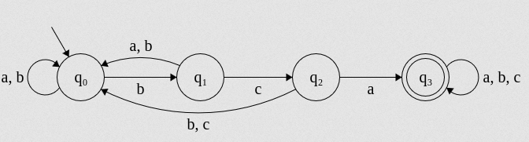
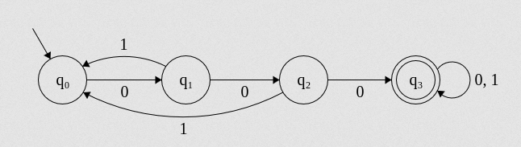

# Module 1 - Formal Language Theory and Regular Languages

## Definitions
| Item             | Definition      |
| ---------------- | --------------- |
| Natural Language | Human Languages |
| Formal Language  | Set of strings  |
| Alphabet         | Fundamental unit of a language|
| Sigma            | Set of Alphabet|

### Example -
For a language defined as \\[ \Sigma = \\{a, b, c\\} \\] There would be many strings like `caa`, `abbc`, `ab`, etc.

## \\(\Sigma^* \\) and \\(\Sigma^+ \\)
\\(\Sigma^* \\) is defined as the set of all strings that can be created from \\(\Sigma\\). This includes a special string called \\(\epsilon\\), which is a string of zero length.
\\(\Sigma^+ \\) is the set of all alphabet without including \\(\epsilon\\).<br>

ie. \\( \Sigma^+ = \Sigma^* - \\{\epsilon\\} \\)

### Questions
#### Q: Set of all strings formed from  = `{a, b}` <br>
<details>
 <summary>Answer</summary>
A: The set could be 
\(L = \{a, aa, aaa, aab, a, ... \}\)
</details>
<hr>

#### Q: Describe the following languages. <br> a) Language having strings of length 3 on \\(\Sigma = \\{a, b\\}\\).
 <details>
 <summary>Answer</summary><br>
\(L = \{aaa, aab, aba, abb, baa, bab, bba, bbb \}\)
 </details>
<hr>

#### b) Set of all strings that start with `a` on \\(\Sigma = \\{a, b\\}\\).
 <details>
 <summary>Answer</summary><br>
\(L = \{a, aa, aaa, abb, aba, aab, abab, abbb, ... \}\)
 </details>
<hr>

#### c) Set of all strings that are all `a` on \\(\Sigma = \\{a, b\\}\\).
 <details>
 <summary>Answer</summary><br>
\(L = \{a, aa, aaa, aaaa, aaaaa, ... \}\)
 </details>
<hr>

#### d) Set of all strings with an odd number of `a` on \\(\Sigma = \\{a, b\\}\\).
 <details>
 <summary>Answer</summary><br>
\(L = \{a, ab, aaa, aaba, aaaaba, ... \}\)
 </details>
<hr>


#### e) Set of all strings with an even number of `b` on \\(\Sigma = \\{a, b\\}\\).
 <details>
 <summary>Answer</summary><br>
\(L = \{ \epsilon, abb, aa, aaa, baaaab, aabbaaa, ... \}\)
 </details>
<hr>


#### f) Set of all strings that are "sheep talk" on \\(\Sigma = \\{a, b\\}\\).
 <details>
 <summary>Answer</summary><br>
\(L = \{ba, baa, baaa, baaaa, baaaaa, ... \}\)
 </details>
<hr>

#### g) Set of all strings with substring `bba` on \\(\Sigma = \\{a, b\\}\\).
<details>
  <summary>Answer</summary><br>
  \(L = \{bba, bbaa, abba, aaaabba, babbaa, ... \}\)
</details>
<hr>

#### h) Set of all strings with length divisible by 3 on \\(\Sigma = \\{a, b\\}\\).
 <details>
 <summary>Answer</summary><br>
\(L = \{\epsilon, aab, baa, abbaaa, ababaaaab, ... \}\)
 </details>
<hr>

## Regular Languages & Finite State Automata.
FSA can be configured in 2 ways.
1) As a language acceptor.
2) As a language transducer.

### Questions
#### Q: Design a serial adder using FSA
<details>
 <summary>Answer</summary><br>


Sample Output for \\(11100101 + 01111010\\)

```
  10   01   10   01   01   11   11   10   10   00
q0   q0   q0   q0   q0   q0   q1   q1   q1   q1   q0  
    1    1    1    1    1    0    1    0    1    0
```

The answer would be \\(0101011111 = 10101111\\)
</details>
<hr>


#### Q: Design an FSA as a Language Acceptor

<details>
 <summary>Answer</summary><br>

</details>
<hr>

#### Q: Design an FSA for accepting \\(L = \\{a^nb : n \ge 0\\}\\)
<details>
 <summary>Answer</summary><br>

</details>
<hr>

#### Q: Design an FSA for accepting \\(L = \\{a^nb : n \ge 1\\}\\)
<details>
 <summary>Answer</summary><br>

</details>
<hr>

#### Q: Design an FSA for accepting \\(L = \\{ab*\\}\\)
<details>
 <summary>Answer</summary><br>

</details>
<hr>

#### Q: Design an FSA for accepting \\(\Sigma^*\\}\\)
<details>
 <summary>Answer</summary><br>

</details>
<hr>

#### Q: Design an FSA for accepting \\(\Sigma^+\\}\\)
<details>
 <summary>Answer</summary><br>

</details>
<hr>

#### Q: Design an FSA for accepting \\(L = \\{(ab)^n\\}\\)
<details>
 <summary>Answer</summary><br>
<br>
  Or more consise,<br>

</details>
<hr>

#### Q: Design an FSA for accepting strings with length divisible by 3 on \\(\Sigma = \\{a, b\\}\\)
<details>
 <summary>Answer</summary><br>

</details>
<hr>

#### Q: Design an FSA for accepting strings with length 3 on \\(\Sigma = \\{a, b\\}\\)
<details>
 <summary>Answer</summary><br>

</details>
<hr>

#### Q: A language \\(L = \\{w:w \in \\{0, 1\\}\\}\\) such that the second symbol is 0 and the 4th is 1.
<details>
 <summary>Answer</summary><br>

</details>
<hr>

#### Q: Design an DFA for accepting strings that have exactly four \\(1\\) on \\(\Sigma = \\{0, 1\\}\\)
<details>
 <summary>Answer</summary><br>

</details>
<hr>

#### Q: Design an DFA for accepting strings on \\(L = \\{a^nb^m:m, n \ge 1\\}\\)
<details>
 <summary>Answer</summary><br>

</details>
<hr>

#### Q: Design an FSA for accepting strings where the number of \\(0\\) are a multiple of 3 on \\(\Sigma = \\{0, 1\\}\\)
<details>
 <summary>Answer</summary><br>

</details>
<hr>

#### Q: Design an FSA for accepting strings that end with \\(11\\) on \\(\Sigma = \\{0, 1\\}\\)
<details>
 <summary>Answer</summary><br>

</details>
<hr>

#### Q: Design an FSA for accepting strings with substring \\(bca\\) on \\(\Sigma = \\{a, b, c\\}\\)
<details>
 <summary>Answer</summary><br>

</details>
<hr>

#### Q: Design an DFA for accepting strings with 3 consecutive \\(0\\) on \\(\Sigma = \\{0, 1\\}\\)
<details>
 <summary>Answer</summary><br>

</details>
<hr>

## DFA
A deterministic finite state automaton can be defined as a 5-tuple.
\\[M = (Q, \Sigma, \delta, q_0, F)\\]
|Symbol|Meaning|
|------|-------|
| \\(Q\\) | Finite set of states.|
| \\(\Sigma\\) | Finite set of input alphabet.|
| \\(q_0\\) | The initial state, \\( q_0 \in Q\\)|
| \\(F\\) | The set of all final states.|
| \\(\delta\\) | Transition function, a mapping from \\(Q \times \Sigma \to Q\\)|

> [!NOTE]
><br> For instance, the transitions for \\(L=a^nb^m\\)<br>
>
>\\[
>\delta(q_0, a) = q_1 \\\\
>\delta(q_0, b) = D \\\\
>\delta(q_1, a) = q_1 \\\\
>\delta(q_1, b) = q_2 \\\\
>\delta(q_2, a) = D \\\\
>\delta(q_2, b) = q_2 \\\\
>\delta(D, a) = D \\\\
>\delta(D, b) = D \\\\
>\\]

### The \\(\hat{\delta}\\) operation.
\\[\hat{\delta}(q, xa) = \delta(\hat{\delta}(q, x), a)\\]

> [!NOTE]
> \\(\hat{\delta}(q, \epsilon) = q \quad \forall \quad q \in Q\\) 

## Language accepted by a DFA

\\[L(M) = \\{w:w \in \Sigma^*,\quad \hat{\delta}(q_0, w) \in F \\}\\]

### Questions 
#### Q: Check if \\(110101\\) is accepted by the DFA
\\(Q = \\{q_0, q_1, q_2, q_3\\}\\\\ \Sigma = \\{0, 1\\}\\\\ F = \\{q_0\\}\\)
|\\(\delta\\)|\\(0\\)|\\(1\\)|
|--|--|--|
|\\(\rightarrow (q_0)\\)|\\(q_2\\)|\\(q_1\\)|
|\\(q_1\\)|\\(q_3\\)|\\(q_0\\)|
|\\(q_2\\)|\\(q_0\\)|\\(q_3\\)|
|\\(q_3\\)|\\(q_1\\)|\\(q_2\\)|
<details>
 <summary>Answer</summary><br>

\\(
\hat{\delta}(q_0, 1) = q_1 \\\\
\hat{\delta}(q_1, 11) = q_0 \\\\
\hat{\delta}(q_0, 110) = q_2 \\\\
\hat{\delta}(q_2, 1101) = q_3 \\\\
\hat{\delta}(q_3, 11010) = q_1 \\\\
\hat{\delta}(q_1, 110101) = q_0 \\\\
\\)

\\(q_0 \in F\\)
\\(\therefore\\) the string \\(110101\\) is accepted.

</details>
<hr>

#### Q: Check if \\(aabb\\) is accepted by \\(L=\\{a^nb^m\\}\\)
<details>
 <summary>Answer</summary><br>

  
|\\(\delta\\)|\\(0\\)|\\(1\\)|
|--|--|--|
|\\(\rightarrow q_0\\)|\\(q_1\\)|\\(D\\)|
|\\(q_1\\)|\\(q_1\\)|\\(q_2\\)|
|\\((q_2)\\)|\\(D\\)|\\(q_2\\)|
|\\(D\\)|\\(D\\)|\\(D\\)|

\\(
\hat{\delta}(q_0, a) = q_1 \\\\
\hat{\delta}(q_1, aa) = q_1 \\\\
\hat{\delta}(q_1, aab) = q_2 \\\\
\hat{\delta}(q_2, aabb) = q_2 \\\\
\\)

\\(q_2 \in F\\)
\\(\therefore\\) the string \\(aabb\\) is accepted.

</details>
<hr>

## Non Deterministic FSA (NFA)
A non deterministic finite state automaton allows 0, 1 or more transitions from a state on the same input symbol.  

> [!NOTE]
> ie. In a DFA, the next state is uniquely determined.

An NFA can be defined as a finite 5-tuple, 
\\[M=(Q, \Sigma, \delta, q_0, F)\\]
|Symbol|Meaning|
|------|-------|
| \\(Q\\) | Finite set of states.|
| \\(\Sigma\\) | Finite set of input alphabet.|
| \\(q_0\\) | The initial state, \\( q_0 \in Q\\)|
| \\(F\\) | The set of all final states.|
| \\(\delta\\) | Transition function, a mapping from \\(Q \times \Sigma \to 2^Q\\)|


### Questions

> [!TIP]
> Will complete later. :)

