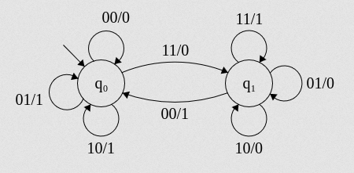
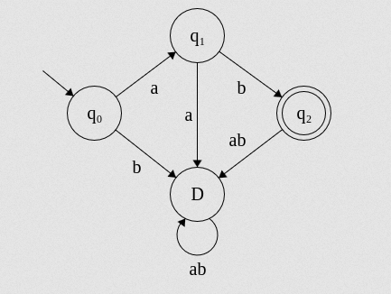
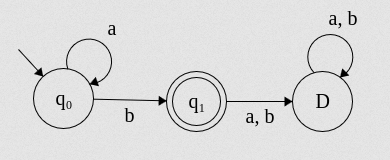
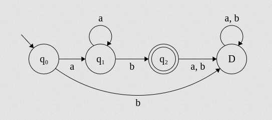
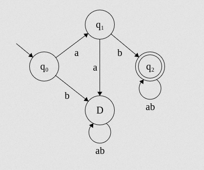
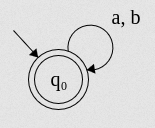
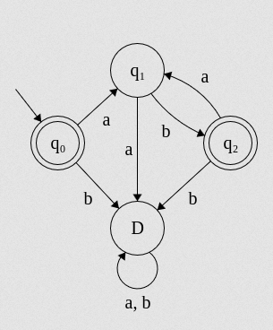
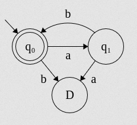
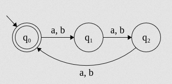
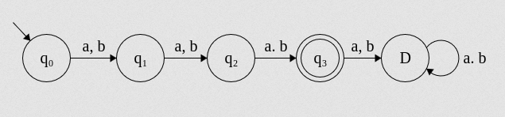

# Module 1 - Formal Languages Theory and Regular Languages

## Definitions
| Item             | Definition      |
| ---------------- | --------------- |
| Natural Language | Human Languages |
| Formal Language  | Set of strings  |
| Alphabet         | Fundamental unit of a language|
| Sigma            | Set of Alphabet|

### Example -
For a language defined as \\[ \Sigma = \\{a, b, c\\} \\] There would be many strings like `caa`, `abbc`, `ab`, etc.

## \\(\Sigma^* \\) and \\(\Sigma^+ \\)
\\(\Sigma^* \\) is defined as the set of all strings that can be created from \\(\Sigma\\). This includes a special string called \\(\epsilon\\), which is a string of zero length.
\\(\Sigma^+ \\) is the set of all alphabet without including \\(\epsilon\\).<br>

ie. \\( \Sigma^+ = \Sigma^* - \\{\epsilon\\} \\)

### Questions
#### Q: Set of all strings formed from  = `{a, b}` <br>
<details>
 <summary>Answer</summary>
A: The set could be 
\(L = \{a, aa, aaa, aab, a, ... \}\)
</details>
<hr>

#### Q: Describe the following languages. <br> a) Language having strings of length 3 on \\(\Sigma = \\{a, b\\}\\).
 <details>
 <summary>Answer</summary><br>
\(L = \{aaa, aab, aba, abb, baa, bab, bba, bbb \}\)
 </details>
<hr>

#### b) Set of all strings that start with `a` on \\(\Sigma = \\{a, b\\}\\).
 <details>
 <summary>Answer</summary><br>
\(L = \{a, aa, aaa, abb, aba, aab, abab, abbb, ... \}\)
 </details>
<hr>

#### c) Set of all strings that are all `a` on \\(\Sigma = \\{a, b\\}\\).
 <details>
 <summary>Answer</summary><br>
\(L = \{a, aa, aaa, aaaa, aaaaa, ... \}\)
 </details>
<hr>

#### d) Set of all strings with an odd number of `a` on \\(\Sigma = \\{a, b\\}\\).
 <details>
 <summary>Answer</summary><br>
\(L = \{a, ab, aaa, aaba, aaaaba, ... \}\)
 </details>
<hr>


#### e) Set of all strings with an even number of `b` on \\(\Sigma = \\{a, b\\}\\).
 <details>
 <summary>Answer</summary><br>
\(L = \{ \epsilon, abb, aa, aaa, baaaab, aabbaaa, ... \}\)
 </details>
<hr>


#### f) Set of all strings that are "sheep talk" on \\(\Sigma = \\{a, b\\}\\).
 <details>
 <summary>Answer</summary><br>
\(L = \{ba, baa, baaa, baaaa, baaaaa, ... \}\)
 </details>
<hr>

#### g) Set of all strings with substring `bba` on \\(\Sigma = \\{a, b\\}\\).
<details>
  <summary>Answer</summary><br>
  \(L = \{bba, bbaa, abba, aaaabba, babbaa, ... \}\)
</details>
<hr>

#### h) Set of all strings with length divisible by 3 on \\(\Sigma = \\{a, b\\}\\).
 <details>
 <summary>Answer</summary><br>
\(L = \{\epsilon, aab, baa, abbaaa, ababaaaab, ... \}\)
 </details>
<hr>

## Regular Languages & Finite State Automata.
FSA can be configured in 2 ways.
1) As a language acceptor.
2) As a language transducer.

### Questions
#### Q: Design a serial adder using FSA
<details>
 <summary>Answer</summary><br>


Sample Output for \\(11100101 + 01111010\\)

```
  10   01   10   01   01   11   11   10   10   00
q0   q0   q0   q0   q0   q0   q1   q1   q1   q1   q0  
    1    1    1    1    1    0    1    0    1    0
```

The answer would be \\(0101011111 = 10101111\\)
</details>
<hr>


#### Q: Design an FSA as a Language Acceptor

<details>
 <summary>Answer</summary><br>

</details>
<hr>

#### Q: Design an FSA for accepting \\(L = \\{a^nb : n \ge 0\\}\\)
<details>
 <summary>Answer</summary><br>

</details>
<hr>

#### Q: Design an FSA for accepting \\(L = \\{a^nb : n \ge 1\\}\\)
<details>
 <summary>Answer</summary><br>

</details>
<hr>

#### Q: Design an FSA for accepting \\(L = \\{ab*\\}\\)
<details>
 <summary>Answer</summary><br>

</details>
<hr>

#### Q: Design an FSA for accepting \\(\Sigma^*\\}\\)
<details>
 <summary>Answer</summary><br>

</details>
<hr>

#### Q: Design an FSA for accepting \\(\Sigma^+\\}\\)
<details>
 <summary>Answer</summary><br>

</details>
<hr>

#### Q: Design an FSA for accepting \\(L = \\{(ab)^n\\}\\)
<details>
 <summary>Answer</summary><br>
<br>
  Or more consise,<br>

</details>
<hr>

#### Q: Design an FSA for accepting strings with length divisible by 3 on \\(\Sigma = \\{a, b\\}\\)
<details>
 <summary>Answer</summary><br>

</details>
<hr>

#### Q: Design an FSA for accepting strings with length 3 on \\(\Sigma = \\{a, b\\}\\)
<details>
 <summary>Answer</summary><br>

</details>
<hr>

